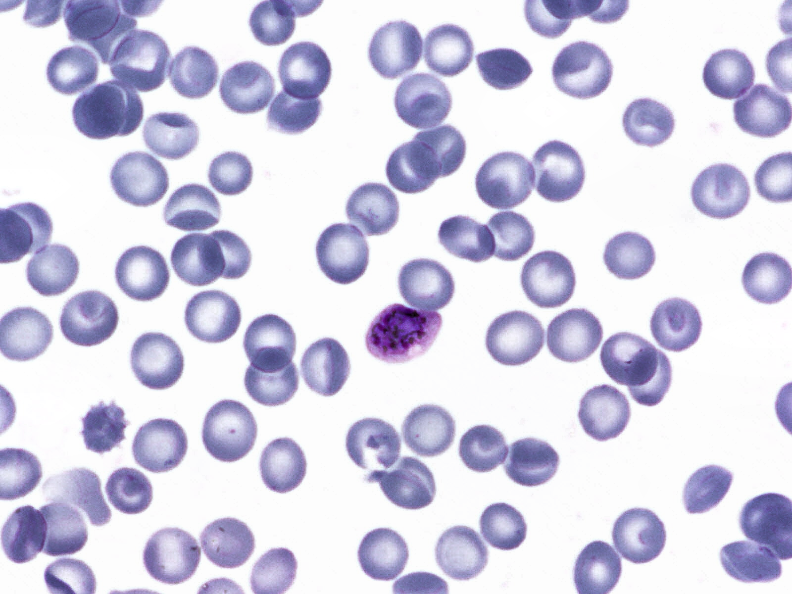
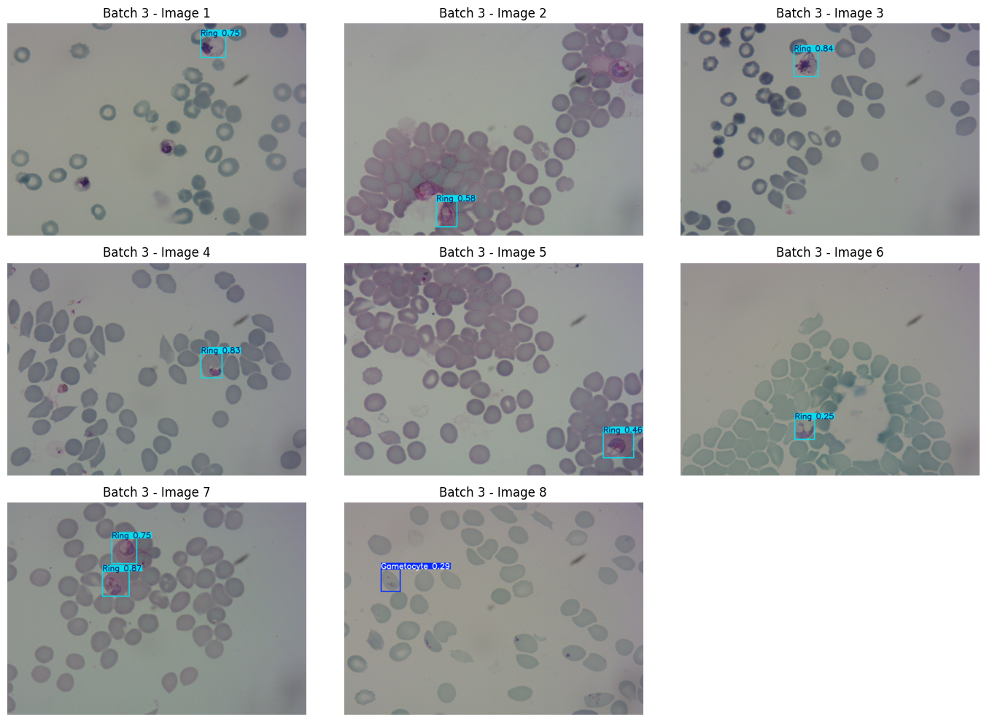

# Malaria Detection Using YOLOv8n

This project leverages YOLOv8n (You Only Look Once, version 8 - nano) to automate malaria diagnosis by detecting and classifying infected and uninfected blood cells in microscopic smear images. It is inspired by the urgent need to accelerate diagnostics in low-resource settings, especially where expert microscopists are unavailable.

---

## Problem Statement

Malaria continues to cause significant mortality, particularly in sub-Saharan Africa. Traditional diagnosis using microscopy is slow and expertise-intensive. This project aims to automate the diagnostic process using computer vision, building a lightweight, portable AI solution that could potentially support field diagnosis in rural communities.

---

## Dataset Overview

- **Source**: [Plasmodium vivax-infected blood smear dataset (Kaggle)](https://www.kaggle.com/datasets/orvile/p-vivax-malaria-infected-human-blood-smears)
- **Format**: Annotated images with bounding boxes for object detection
- **Classes (7 total)**:
  1. Gametocyte  
  2. Ring  
  3. Schizont  
  4. Trophozoite  
  5. Difficult (ambiguous/unclear cells)  
  6. Uninfected RBC  
  7. Leukocyte  

---

## 🛠Tools & Technologies

- **Model**: YOLOv8n (Ultralytics)
- **Language**: Python
- **Platform**: Google Colab
- **Libraries**: Ultralytics, Albumentations, OpenCV, matplotlib
- **Data Handling**: YOLO-format annotations (converted from JSON)

---

## Key Steps

- ✅ Converted JSON annotations to YOLO format
- ✅ Handled class imbalance (downsampling RBCs + Albumentations for rare classes)
- ✅ Structured training and validation folders
- ✅ Trained YOLOv8n using custom `data.yaml`
- ✅ Evaluated model with mAP@0.5 and sample predictions

---

## Results

- **mAP@0.5**: 72.9% (validation set)
- Successfully detected difficult-to-identify cells (Class 5: "Difficult")
- Enhanced rare class performance through targeted augmentation

---

## Sample Output

| Original Image | YOLOv8n Prediction |
|----------------|--------------------|
|  |  |

> *(Add screenshots to the `images/` folder and update file names above)*

---

## Notebook Access

📓 **View Full Project on Google Colab**  
👉🏾 [Click here to open the notebook](https://colab.research.google.com/drive/1tqwIfiBgJUrpkVHxjII8Mjz3a_KlqU_O?usp=sharing)

---

## Project Highlights

- ✅ Public health–driven use case with real-world impact
- ✅ Focused on automation for low-resource and rural settings
- ✅ Addressed class imbalance in object detection
- ✅ Built with scalable, open-source tools

---

## Project Links

- 📘 Dataset: *[Kaggle](https://www.kaggle.com/datasets/orvile/p-vivax-malaria-infected-human-blood-smears)*
- 📓 Notebook: *[Colab](https://colab.research.google.com/drive/1tqwIfiBgJUrpkVHxjII8Mjz3a_KlqU_O?usp=sharing)*
- 🔬 YOLOv8 Docs: [Ultralytics YOLOv8](https://docs.ultralytics.com/)

---

## 🙋🏽‍♀About Me

Hi! I'm **Amarachi**, a data scientist and public health advocate passionate about building AI solutions to real-world health problems. This project represents a step toward smarter, faster diagnostics for underserved communities.

🔗 [LinkedIn](https://www.linkedin.com/in/favouralor) | 📂 [More Projects Coming Soon](#)

---

## Future Plans

This project is more than a model, i believe it’s the beginning of a real-world diagnostic tool. Here’s what’s next:

---

#### Model & Data Expansion

* Retrain with **region-specific blood smear images** from local hospitals or labs
* Expand detection to include **P. falciparum**, **mixed infections**, and **rare/ambiguous cases**
* Improve accuracy on overlapping cells and low-quality smears using **data augmentation and calibration**
* Develop **confidence scoring** and **false-positive filtering** to boost real-world trust

---

#### Deployment & Accessibility

* Deploy an interactive **web app using Streamlit or Gradio**
* Optimize for **mobile use** (TFLite or YOLOv8n on Android)
* Develop a lightweight **desktop version** for offline use in clinics
* Connect to **USB digital microscopes** or phone cameras for real-time detection

---

#### Clinical Testing & Validation

* Partner with rural PHCs and hospitals for **pilot testing**
* Validate predictions against **certified lab scientists’ diagnoses**
* Evaluate model performance using:

  * Sensitivity & Specificity
  * Precision & Recall
  * PPV/NPV & Confidence Intervals

---

#### Field Readiness

* Package into a **“Malaria-in-a-Box” toolkit** with offline software + portable microscope
* Design for **low-power, low-internet** environments (e.g., solar-powered Raspberry Pi)
* Localize language + user interface for frontline health workers

---

#### Scaling & Collaboration

* Collaborate with **NGOs, health ministries, and university labs**
* Apply for **AI4Health, Gates Foundation, or Wellcome Trust funding**
* Open-source a “MalariaVision” SDK to adapt for other diseases (e.g., TB, sickle cell)
* Present findings at **MICCAI, NeurIPS Health, or WHO innovation forums**

